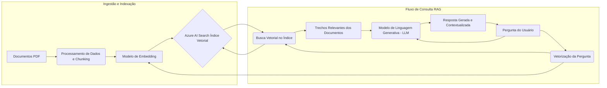

# Chatbot Inteligente com seus Próprios Documentos (PDF) 🧠💬

Este projeto demonstra a criação de um chatbot interativo capaz de responder perguntas com base no **conteúdo dos seus arquivos PDF** utilizando Inteligência Artificial Generativa e busca vetorial. Uma ferramenta poderosa para extrair informações específicas de um conjunto de documentos! ✨

## O Desafio 📚🔍

Imagine a dificuldade de gerenciar e extrair informações de uma grande quantidade de documentos, como artigos científicos para um TCC, documentos como regulamentos, políticas, contratos de trabalho, etc. Correlacionar ideias, encontrar pontos relevantes entre diferentes textos e estruturar uma pesquisa pode ser um processo demorado e complexo. 🤔

## A Solução com Inteligência Artificial 💡🤖

Para enfrentar esse desafio, utilizamos a inteligência artificial para construir um sistema de busca inteligente. O objetivo é permitir que um modelo de linguagem **interprete o conteúdo dos seus PDFs**, organize essas informações e **gere respostas precisas e contextuais** para as suas perguntas, utilizando *apenas* o material que você carregou.

## Objetivos Alcançados ✅

Neste projeto, você aprenderá a e demonstrará a capacidade de:

*   **Carregar** arquivos PDF contendo informações relevantes. 📂
*   Implementar um sistema de **busca vetorial** para indexar e recuperar informações de forma eficiente dos PDFs. 📊
*   Utilizar inteligência artificial para **gerar respostas** fundamentadas no conteúdo dos documentos carregados. ✍️
*   Desenvolver um **chat interativo** para fazer perguntas e obter respostas diretas e baseadas nos seus arquivos. 🗣️

## Como a Mágica Acontece (Visão Técnica) ✨🤓

A arquitetura por trás deste chatbot é conhecida como **Retrieval Augmented Generation (RAG)**. O processo funciona assim:

1.  **Processamento de Documentos:** O conteúdo dos PDFs é dividido em pedaços menores.
2.  **Embeddings:** Cada pedaço de texto é convertido em um **vetor numérico** (representando seu significado semântico) usando um modelo de embedding.
3.  **Indexação Vetorial:** Esses vetores são armazenados e indexados em um serviço de busca vetorial (como o Azure AI Search), criando um índice pesquisável dos seus documentos.
4.  **Ao Fazer uma Pergunta:** Sua pergunta é convertida em um vetor.
5.  **Busca por Relevância:** O sistema busca no índice vetorial os pedaços de texto dos seus documentos que são mais semanticamente semelhantes à sua pergunta.
6.  **Geração da Resposta:** Os trechos de texto mais relevantes encontrados são usados como **contexto** para um modelo de linguagem generativo (como o GPT). O modelo, então, formula a resposta à sua pergunta com base *exclusivamente* nesse contexto fornecido pelos seus documentos.

Esta abordagem permite que o chatbot responda com **informações altamente relevantes e específicas** aos seus documentos carregados, o que é ideal para pesquisa, análise de dados internos ou qualquer cenário onde você precise interagir com um conjunto de informações proprietárias. ⚙️

## Implementação com Azure AI Foundry 🛠️☁️

Este projeto foi implementado utilizando a plataforma **Azure AI Foundry**. O Foundry facilita diversas etapas, incluindo:

*   Preparação do ambiente.
*   Deploy dos modelos de IA necessários (modelos de embedding e modelos de chat).
*   Carregamento dos arquivos PDF.
*   Criação e gerenciamento do índice de busca vetorial.

A interação com o chatbot pode ser feita através do **playground** da plataforma ou, como explorado no projeto, deployando-o como um **web app** para facilitar o acesso.

O Azure AI Foundry é uma plataforma versátil que oferece muito mais do que apenas chatbots, incluindo serviços para criação de agentes autônomos e fluxos de trabalho de IA (Prompt Flows). 🚀

## Diagrama:

## Documentação da Arquitetura 📝

O diagrama acima representa o fluxo de dados e processos que permite ao chatbot responder perguntas com base nos seus arquivos PDF dentro do **Azure AI Foundry**. A arquitetura pode ser dividida em duas fases principais:

1.  **Fase de Ingestão e Indexação:**
    *   Começa com os seus **Documentos PDF**, que contêm as informações que o chatbot deve usar.
    *   Estes documentos passam por um **Processamento de Dados** onde são lidos e divididos em pedaços menores (chunks).
    *   Cada pedaço de texto é transformado em um **vetor numérico** utilizando um **Modelo de Embedding** dedicado. Esse vetor captura o significado semântico do texto.
    *   Os vetores (embeddings) são então armazenados e indexados no **Azure AI Search**, criando um **Índice Vetorial** otimizado para buscas de similaridade.

2.  **Fase de Consulta (RAG - Retrieval Augmented Generation):**
    *   Quando o **Usuário** faz uma **Pergunta**, essa pergunta também é transformada em um vetor numérico usando o **mesmo Modelo de Embedding**.
    *   Este vetor da pergunta é usado para realizar uma **Busca Vetorial** no **Índice Vetorial** do Azure AI Search, procurando pelos trechos de documentos cujos vetores são mais semelhantes ao vetor da pergunta.
    *   Os **Trechos Relevantes** dos documentos encontrados são recuperados.
    *   A **Pergunta do Usuário original** e os **Trechos Relevantes** recuperados (que servem como **contexto**) são enviados para um **Modelo de Linguagem Generativa (LLM)**, como o GPT-4.
    *   O **LLM** processa a pergunta *utilizando unicamente o contexto fornecido* pelos trechos relevantes dos seus documentos para gerar a **Resposta Gerada e Contextualizada**.
    *   A resposta é então apresentada de volta ao usuário.

Todo esse processo é orquestrado e executado dentro da plataforma **Azure AI Foundry**, que facilita o deploy dos modelos, o gerenciamento do índice de busca e a criação do playground ou web app para interação. Esta abordagem garante que as respostas do chatbot sejam precisas e diretamente fundamentadas no conteúdo dos seus próprios documentos, não apenas no conhecimento geral do LLM.

