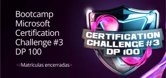
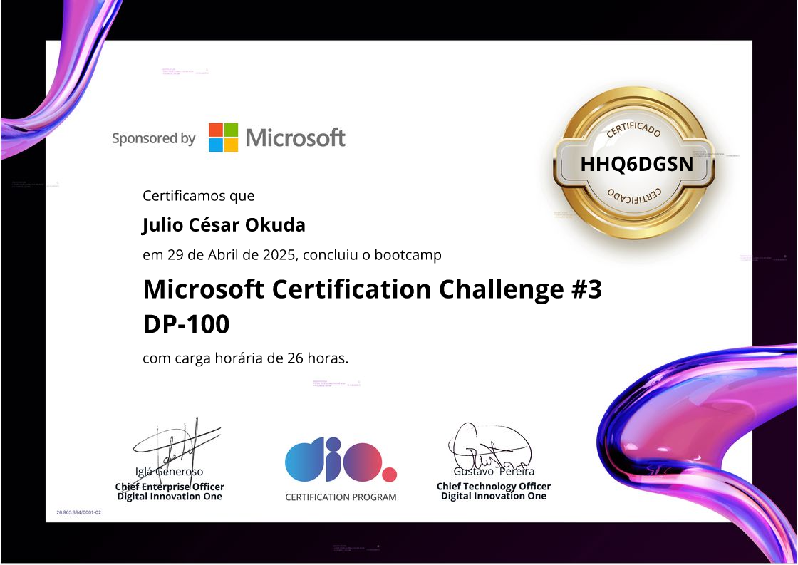

# 🚀 Bootcamp Microsoft Certification Challenge DP-100

## 🎯 Sobre o Bootcamp

Este bootcamp oferece tudo o que você precisa para dominar Análise de Dados focada em Machine Learning dentro do Azure e se preparar para a certificação **DP-100: Designing and Implementing a Data Science Solution on Azure**. Além de trilhar o caminho até a certificação oficial, os participantes concorrem a um Hackathon Microsoft com prêmio de **US$ 10.000**.

### ✨ Destaques do Programa

- 📚 Conteúdo completo e linear para exame **DP-100**  
- 🎫 Voucher gratuito para certificação (até 30 dias após conclusão, para os 500 primeiros formados até **11/05/2025**)  
- 💡 Acesso ao Hackathon da Microsoft com prêmio de US$ 10.000  
- 👨‍🏫 Aulas e mentorias conduzidas por **MVPs da Microsoft**  
- ⚡ Hands-on com Azure Machine Learning: do setup do workspace à implantação de modelos  
- 📊 30 cursos, 3 projetos desafiadores e 2 desafios de código  

## 🛠️ Estrutura do Bootcamp

### 📌 Atividades Principais

1. **Mentorias (Ao Vivo)** 🎥  
   - Interação com Felipe Aguiar e Victor Haruo (DIO)  
   - Sessões Q&A sobre carreira e tecnologia  
2. **Desafios de Código** 💻  
   - Teste de lógica e automação em Azure ML  
   - Código versionado com Git & GitHub  
3. **Desafios de Projeto** 🏗️  
   - Projetos práticos para portfólio  
   - Uso de MLflow, RAG, fine-tuning e chatbots com PDFs  
4. **Ranking e Premiações** 🏆  
   - Pontuação por interações, quizzes e qualidade de código  

## 📚 Conteúdo Programático

- **Introdução à Ciência de Dados**  
  - Microsoft Certification Challenge #3 – DP-100  
  - Ciclo de Vida do Processo de Ciência de Dados  
  - Projetar uma Solução de Aprendizado de Máquina  
  - Git & GitHub  
- **Explorar e Configurar o Workspace**  
  - Workspaces no Azure ML  
  - Ferramentas de Desenvolvimento  
  - Disponibilização de Dados  
  - Ambientes e Destinos de Computação  
- **Experimentos com Azure ML**  
  - AutoML e MLflow (treino & monitoramento)  
- **Otimização de Treinamento**  
  - Ajuste de hiperparâmetros  
  - Pipelines e scripts no Azure ML  
- **Gerenciamento e Monitoramento**  
  - Registro de modelos  
  - Painéis de IA Responsável  
- **Implantação de Modelos**  
  - Endpoints (online e batch)  
- **Modelos Generativos (Azure AI Foundry)**  
  - Prompt engineering, RAG, fine-tuning  
  - Chatbot baseado em PDFs  
- **Simulado Preparatório DP-100**  
  - Questões práticas para fixação  

## 🔧 Ferramentas de Aprendizado

- **Fórum**: 💬 Troca de dúvidas e insights  
- **Salas de Estudo**: 👥 Networking com colegas  
- **Lista de Participantes**: 📋 Quem está na mesma jornada  
- **Certificados**: 🎓 Certifique cada módulo e desafio  

## ℹ️ Informações Importantes

- ⏰ Voucher para exame DP-100 enviado em até 30 dias (para os primeiros 500 formados até 11/05/2025)  
- 🏁 Bootcamp concluído a qualquer momento, mas inscreva-se rápido para garantir o voucher  
- 📘 Conteúdo alinhado ao exame Microsoft DP-100 (Design and Implement Data Science Solutions on Azure)  

## 📂 Índice de Desafios e Projetos

### 🚀 Projetos Práticos

- **Projeto 1**: [reinando Seu Primeiro Modelo de Machine Learning para Prever Vendas](https://github.com/Jcnok/Microsoft-Certification-Challenge--3-DP-100/tree/master/Desafio_1#projeto-previs%C3%A3o-de-vendas-de-sorvete-com-machine-learning)  
- **Projeto 2**: [Criando um Chatbot Baseado em Conteúdo de PDFs](https://github.com/Jcnok/Microsoft-Certification-Challenge--3-DP-100/tree/master/Desafio_2#chatbot-inteligente-com-seus-pr%C3%B3prios-documentos-pdf-)  

### 💻 Desafios de Código

- **Código 1**: Fundamentos do Azure Machine Learning  
- **Código 2**: Modelagem e Monitoramento com MLflow  

## 🎯 Conclusão e Opinião Pessoal

Concluir este bootcamp foi uma jornada transformadora: aprendi desde a configuração de workspaces até ajustes finos em modelos generativos. As mentorias ao vivo e o suporte da comunidade DIO foram fundamentais para solidificar conhecimentos e preparar-me para o exame **DP-100**.

---

## 📫 Contatos e Redes Sociais

Vamos nos conectar? 🤝

### 🎯 Habilidades em Desenvolvimento

  

---
