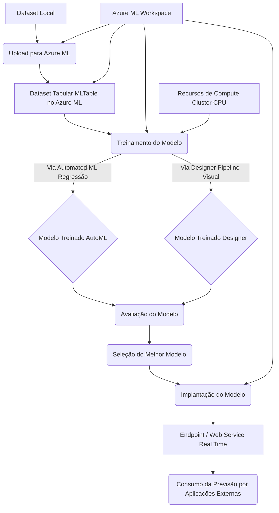

# Projeto: Previsão de Vendas de Sorvete com Machine Learning


## 🍦 Contexto e Problema de Negócio

Este projeto aborda um problema comum no varejo sazonal, especificamente para uma sorveteria. Imagine ser o dono da Gelato Mágico, uma sorveteria em uma cidade litorânea. Embora as vendas disparem no verão, há uma forte correlação entre a **temperatura do dia e a quantidade de sorvetes vendidos**.

A falta de previsibilidade sobre as vendas diárias gera diversos desafios e "dores" para o negócio:
*   Levar **estoque excessivo** para vender com o carrinho e não vender tudo devido à baixa temperatura/clima.
*   **Perder sorvete** devido ao excesso de estoque que descongela, resultando em **prejuízo**.
*   Desgaste físico por transportar estoque desnecessário.
*   Comprar **material em excesso** para produzir sorvete que não será vendido.
*   **Incerteza** sobre o **custo**, a **venda** e o **retorno**.

Essa incerteza dificulta o planejamento eficiente da produção e da logística.

## ✨ Objetivo do Projeto

Para solucionar o problema da falta de previsibilidade e suas consequências, o objetivo deste projeto é **desenvolver um modelo de regressão preditiva usando Machine Learning**. Este modelo terá como finalidade **prever a quantidade de sorvetes que serão vendidos com base na temperatura do dia**.

Os objetivos técnicos e de negócio incluem:
*   ✅ **Treinar um modelo de Machine Learning** para prever as vendas de sorvete [Prompt, 11].
*   ✅ **Otimizar a produção**, **evitar desperdícios** e **garantir estoque suficiente**.
*   ✅ Registrar e gerenciar o modelo usando o MLflow [Prompt].
*   ✅ Implementar o modelo para previsões em tempo real em um ambiente de cloud computing (Azure ML) [Prompt, 8, 9].
*   ✅ Criar um pipeline estruturado para treinar e testar o modelo, garantindo reprodutibilidade [Prompt, 5].

## 💰⏱️ Benefícios Monetários e de Tempo

A implementação deste modelo preditivo visa trazer **benefícios significativos**, principalmente em termos **monetários e de tempo**. Ao prever a demanda futura (vendas de sorvete com base na temperatura), será possível:

*   **Economizar dinheiro** ao otimizar a produção e evitar desperdícios.
*   **Evitar prejuízos diretos**, como a perda de sorvete que descongela por excesso de estoque.
*   **Não comprar material em excesso** para produção desnecessária.
*   Ter maior **certeza de custo, venda e retorno**.
*   Possibilidade de criar **promoções ou descontos** estratégicos baseados na previsão do clima/temperatura para otimizar as vendas.
*   **Economizar tempo** tanto na compra dos produtos necessários para a produção quanto na venda (lidando com estoque adequado).
*   Melhor gestão e alocação de recursos.

Em suma, o projeto transforma dados (temperatura e vendas) em uma ferramenta estratégica para **reduzir custos, minimizar perdas e otimizar operações**, impactando diretamente o resultado financeiro e a eficiência operacional.

## 🤖 Abordagem e Implementação Técnica

### Diagrama:



**Explicação do Diagrama:**

Este diagrama ilustra o fluxo principal do experimento no Azure ML:

1.  Os **Dados Locais** (arquivo CSV com vendas e temperatura) são o ponto de partida.
2.  Eles são **Upados para o Azure ML**.
3.  No Azure ML, um **Dataset Tabular (MLTable)** é criado para gerenciar esses dados.
4.  Este dataset é usado para o **Treinamento do Modelo**.
5.  Foram exploradas duas abordagens de treinamento: **Automated ML (AutoML)** configurado para Regressão e um **Designer Pipeline** visual.
6.  Os modelos são então **Avaliados** para verificar sua performance.
7.  Com base na avaliação, o **Melhor Modelo** é Selecionado.
8.  Este modelo selecionado é **Implantado**.
9.  A implantação cria um **Endpoint / Web Service (Real Time)** que pode ser acessado.
10. Finalmente, o **Consumo da Previsão** ocorre quando outras aplicações chamam este Endpoint.
11. O **Azure ML Workspace** e os **Recursos de Compute** (como o Cluster CPU) são os ambientes e infraestruturas que suportam todas essas etapas dentro do Azure.

---

**Tecnologias Utilizadas no Experimento/POC:**

As principais tecnologias e ferramentas empregadas para executar o experimento de previsão de vendas de sorvete foram:

*   **Plataforma Principal:** **Azure Machine Learning** - Utilizada para gerenciar todo o ciclo de vida do experimento, desde o preparo dos dados até a implantação do modelo.
*   **Recursos de Computação:** **Azure ML Compute** (Instância de Computação para notebooks, e **Cluster CPU** para os Jobs de treinamento).
*   **Gerenciamento de Dados:** **Azure ML Datasets** (formato **MLTable** para dados tabulares). Os dados de origem eram um arquivo local (CSV).
*   **Métodos de Modelagem e Treinamento:**
    *   **Azure ML Automated ML (AutoML)**: Configurado para tarefas de Regressão.
    *   **Azure ML Designer:** Ferramenta visual para construção de pipelines de ML, utilizando módulos como Split Data, Linear Regression, Train Model, Score Model, Evaluate Model.
    *   *(Algoritmos Utilizados/Testados):* **Linear Regression** (usada no Designer) e **Gradient Boosting Regressor** (selecionado para ser testado no AutoML).
*   **Avaliação de Modelo:** Métricas de avaliação de regressão (como R-squared, para revisão dos resultados do AutoML).
*   **Implantação:** **Azure ML Endpoints** para criar **Web Services (Real Time)**.
*   **Geração de Dados (Setup):** **Large Language Models (LLMs)** como Microsoft CoPilot, ChatGPT, etc. foram usados para criar o dataset inicial de vendas e temperatura e como guia para agilizar todo o processo.


### O processo envolveu as seguintes etapas:

1.  **Configuração do Ambiente no Azure ML:**
    *   Criação de um Grupo de Recurso (ex: `RG-DioProjeto1`).
    *   Criação de um Workspace no Azure Machine Learning (ex: `workspace-Dio`) dentro do Grupo de Recurso.
    *   Provisionamento de recursos de computação: uma Instância de Computação (para notebooks, embora não utilizada diretamente nos trechos fonte) e um Compute Cluster (para jobs de treinamento).

2.  **Preparação dos Dados:**
    *   Obtenção de um dataset contendo as colunas 'vendas' e 'temperatura'. Este dataset foi gerado com o auxílio de uma Inteligência Artificial (como CoPilot/ChatGPT).
    *   Criação de um **dataset tabular** (`mltable`) no Azure ML, carregando o arquivo local e selecionando as colunas relevantes ('vendas' e 'temperatura').
    *   Visualização e análise inicial dos dados para observar a correlação entre temperatura e vendas.

3.  **Modelagem e Treinamento:**
    *   O objetivo é encontrar a **equação da reta** que melhor se ajusta aos dados, representando a relação entre temperatura e vendas, buscando **minimizar o erro** entre o previsto e o real.
    *   Foram exploradas duas abordagens de treinamento no Azure ML:
        *   **Automated ML (AutoML):** Configuração de um job de **regressão**, definindo 'vendas' como a coluna target (a ser prevista). Possibilidade de restringir os algoritmos testados (ex: apenas Gradient Boosting Regressor) para agilizar o processo. O AutoML busca o melhor modelo e hiperparâmetros automaticamente.
        *   **Designer:** Construção de um pipeline visual. Carregamento do dataset, divisão dos dados (e.g., 80% treino, 20% validação/score). Utilização dos módulos de **Linear Regression**, **Train Model** (especificando 'vendas' como label), **Score Model** (para fazer previsões nos dados de validação), e **Evaluate Model** (para medir a performance).
    *   *(Conceitual):* O conceito de minimizar o erro para encontrar a melhor linha de regressão também foi ilustrado através de uma simulação em planilha Excel.

4.  **Avaliação do Modelo:**
    *   Após o treinamento, a performance do modelo foi verificada comparando os valores previstos ('scored label') com os valores reais ('vendas') nos dados de validação.
    *   Observação da proximidade entre os valores previstos e reais, notando a margem de erro. Métricas como R-squared podem ser analisadas.

5.  **Implantação (Deployment):**
    *   O modelo com melhor performance (selecionado do AutoML ou treinado no Designer) pode ser implantado como um **Web Service (Real Time)** nos Endpoints do Azure ML.
    *   A implantação cria um **endpoint (URL)** que pode ser consumido por outras aplicações (APIs, aplicativos, calculadoras, etc.) para obter previsões em tempo real, fornecendo a temperatura e recebendo a previsão de vendas.

6.  **Uso da Previsão:**
    *   Com o modelo implantado, é possível inserir a previsão de temperatura para um determinado período e obter a estimativa de vendas. Essa previsão orienta as decisões de negócio, como a quantidade a produzir, material a comprar, estoque a levar, e a definição de promoções.

## 📊 Dados

O dataset utilizado foi criado especificamente para este projeto com auxílio de uma IA. Ele contém aproximadamente 100 linhas e duas colunas principais:
*   `vendas`: Quantidade de sorvetes vendidos.
*   `temperatura`: Temperatura ambiente no dia da venda.

A correlação entre essas duas variáveis é o foco da modelagem.

## 📁 Estrutura do Repositório

Este repositório segue a seguinte estrutura (conforme solicitado para entrega do projeto):

```
.
├── Data/
│   └── dataset.csv
└── README.md
```

## 🖼️ Screenshots

*(Espaço reservado para você adicionar seus screenshots)*

*   A estrutura do seu Workspace no Azure ML.
*   O dataset carregado e sua visualização no Azure ML.
*   A configuração do job de AutoML e seus resultados.
*   O pipeline visual construído no Designer.
*   Os resultados da avaliação do modelo.
*   O endpoint do modelo implantado.

## 💡 Aprendizados e Insights

Durante o desenvolvimento deste projeto, diversos conceitos e habilidades foram explorados e reforçados:
*   A importância de **identificar uma dor ou problema de negócio real** que possa ser resolvido ou mitigado com ciência de dados e Machine Learning.
*   Foco nos **benefícios de negócio**, especialmente **monetários e de tempo**, como justificativa para a criação de modelos preditivos.
*   Aplicação prática de modelos de **regressão linear/preditiva** para encontrar relações entre variáveis.
*   Utilização da plataforma **Azure Machine Learning** para gerenciar o ciclo de vida de um projeto de ML (criação de ambiente, preparação de dados, treinamento via AutoML e Designer, avaliação e implantação).
*   Compreensão conceitual da **minimizarão do erro** como base para encontrar o modelo de regressão ideal.
*   Aprender a criar e documentar um projeto de ciência de dados com um **storytelling** claro (do problema à solução e benefícios) para enriquecer o portfólio.
*   Explorar o uso de **Inteligência Artificial generativa** (LLMs) para auxiliar na criação de datasets e no brainstorming de casos de uso.

## Próximos Passos / Possibilidades de Melhoria

*   Explorar outros algoritmos de regressão além da Regressão Linear e Gradient Boosting.
*   Adicionar mais *features* ao dataset (ex: dia da semana, feriados, eventos locais) para melhorar a precisão da previsão.
*   Implementar o MLflow de forma mais aprofundada para rastrear experimentos e parâmetros.
*   Construir uma interface simples (Web App) que consuma o endpoint implantado para facilitar a entrada da temperatura e visualização da previsão.
*   Configurar um pipeline de MLOps para automação do treinamento e implantação.

## 🧑‍💻 Autor

*   [Linkedin](https://www.linkedin.com/in/julio-okuda/)
*   [github.com](https://github.com/Jcnok)
